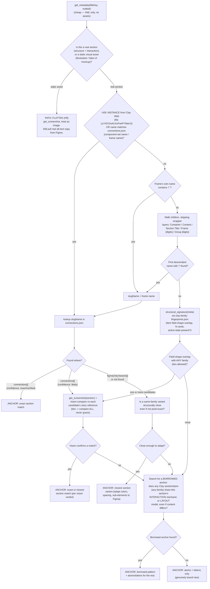
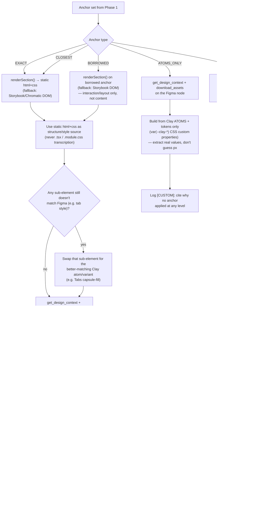

# Clay Integration — Section Resolution Process

## Contents
- Discovering the Clay repo (never a hardcoded path)
- The governing principle
- Global chrome (header/nav/footer): check `connections.json` before reverse-engineering a live reference
- H28 — Clay-Web library instances and Clay names must resolve to coded Clay
- How to use this on a new page
- Phase 1 — Resolve
- Worked example — one real page (calibration only)
- Phase 2 — Build
- A user-supplied live-site reference is a code source, not a screenshot
- Open questions

A general-purpose process for building any Figma page as real HTML/CSS/JS, using Clay's coded
component library to get there faster and with fewer bugs than reverse-engineering everything
from raw pixel values. **This is not a "Figma → Clay page" pipeline** — the deliverable is
always a 1:1 reproduction of the Figma page, in plain HTML/CSS/JS (H2 still applies — no Clay
component names in the output). Clay never defines what the output should look like; it's a
resource this process consults along the way.

## Discovering the Clay repo (never a hardcoded path)

**Never hardcode a Clay repo path** — a prior version of this skill hardcoded a specific
person's machine-local checkout path, which doesn't exist on any other machine. Discover it
instead:

**The canonical Clay repo is `https://github.com/eliorsi-hash/clay-design-system`.** Use this
to *validate* a candidate checkout (does `git remote -v` inside it point to this URL?), and as
the clone target when no local checkout exists at all and the user wants one created — never as
a hardcoded local filesystem path, which is the exact thing this section exists to prevent.

1. Check common developer checkout locations for a directory containing
   `packages/react/src/figma/connections.json` and `packages/tokens/dist/tokens.css` — e.g.
   `~/Development/clay-design-system`, `~/Development/*/clay-design-system`, or a path the user
   has previously mentioned in this project's own trace/notes files.
2. **If more than one valid checkout is found** (confirmed real case: 3 separate checkouts
   existed on one machine), the tiebreak is now two-tier, not just "most recent commit":
   - **First**, check each candidate's `git remote -v` against the canonical URL above. A
     checkout whose remote matches is the authoritative one — prefer it outright over a
     candidate with no remote, a fork, or an unrelated remote.
   - **If multiple candidates all match the canonical remote** (e.g. separate clones/worktrees),
     *then* fall back to most-recently-committed (`git log -1 --format=%cd` per candidate).
   - **State which one was picked and why** in the session's trace log either way. This is a
     tiebreak, not a guarantee of correctness — if the choice matters for a specific build (e.g.
     a token value differs between checkouts), flag it.
3. If not found by search, **ask the user directly** for the checkout path — do not guess
   further and do not silently fall back to deriving CSS from raw Figma pixel values instead
   (see `PREREQUISITES.md` — this is a hard halt condition, not a soft degrade).
4. Once found, record the path for the rest of the session rather than re-discovering it per
   section. **In an environment where shell state does not persist between tool calls** (a real
   observed case), the discovered Node/Clay paths must be re-asserted in every individual
   command, not just resolved once — "resolve once per session" is not sufficient there.

The same rule applies to any other machine-specific path this process needs (a Chromium
binary for local screenshot tooling, a Storybook port) — discover or ask, never hardcode.

**Clay's own design-system source lives in two places, not one:**
- **Code**: `https://github.com/eliorsi-hash/clay-design-system` (above) — the coded components,
  `connections.json` registry, and compiled tokens this whole process resolves against.
- **Design**: `https://www.figma.com/design/LyYrDV2oALKuPoePY9aeJJ/Clay-Web` — "Clay Web," the
  actual Figma file the coded components were built from (this is the same `LyYrDV2oALKuPoePY9aeJJ`
  file key referenced inside `connections.json`'s own metadata). Use it when you need to **see**
  a component/variant visually — e.g. to confirm by eye whether a `CLOSEST` or `BORROWED`
  candidate really looks right before committing to it, browsing what a variant like "Features/
  Tabs/Media right/With title" actually looks like on its own canonical frame, or double-
  checking a `figmaOnlyVariants` entry's real appearance. This is a normal Figma file — read it
  with the same Figma MCP tools (`get_screenshot`, `get_metadata`) used on the product file being
  built, just pointed at this file key instead.

## The governing principle

**Figma is the source of truth for the final look and behavior, full stop. Clay is a toolbox,
not a spec.** A name or shape match in `connections.json` is a *lead worth checking*, never a
verdict that overrides what Figma shows. Concretely:

- If a matched Clay component's default doesn't match Figma exactly, **Figma wins** — adapt or
  override the component (colors, spacing, one sub-element, or drop it for that piece
  entirely). "That's not what the component supports" is never a reason to under-deliver.
- If there's no coded Clay equivalent at all (a confirmed gap), that doesn't lower the bar
  either — it just means there's no scaffold to start from. The piece still gets built to match
  Figma exactly, out of smaller ingredients (atoms, tokens) instead of a full section.
- Even a section that ends up looking identical to a Clay story only stays that way because it
  happens to match Figma — never because matching the story was the goal.
- **Excluded elements come off, unconditionally.** If the Figma instance has a `hidden: true`
  sibling (a second CTA, an unused slot), it's not part of the section — don't render it just
  because the matched Clay component supports it or the default story shows it.
- **"Figma wins" applies at the layout-mechanism level, not just individual CSS values.**
  Confirmed real case: a matched Clay carousel component's real coded behavior is one full-width
  card sliding at a time (`flex: 0 0 100%`, `transform`-driven) — but the actual Figma design
  showed 3 cards visible simultaneously with the center one focused and the siblings faded/
  scaled down (a "peek" arrangement). This isn't a token/value mismatch (padding, font-size,
  color) like the earlier confirmed cases — it's the whole interaction/layout model differing.
  The fix pattern is the same as any other Figma-wins case: keep Clay's tokens and internal
  card/tab structure (spacing, typography, color roles), but rebuild the actual
  layout/presentation mechanism to match what Figma really shows, rather than assuming a
  structural match because the component/family match was confirmed exact.

**Clay is the code basis (real structure, real CSS mechanism, real class names and cascade) —
but every content-level value (font-size, weight, letter-spacing, line-height, color, spacing
that Figma explicitly overrides) must be individually verified against the Figma node's own
resolved style, never assumed from the matched Clay component's default scale.** Confirmed real
mistake: a "split"-layout hero matched to Clay's `HeaderSection`, whose default heading scale is
`h1` (72px desktop) — but `get_design_context`'s resolved-style annotation for the actual text
node ("styles are contained in the design: Web/Heading 3/Desktop: ... size:
font-size/heading-3/desktop ... 48px") showed this instance was authored at a different, smaller
scale entirely. Copying Clay's h1 token because the *component* defaults to h1 reproduced the
wrong size with high confidence. **The fix, and the rule going forward:** pull every text node's
real `get_design_context` style annotation (the "styles are contained in the design: ..." line —
family, style name, resolved size/weight/lineHeight/letterSpacing) before writing its CSS, even
when a Clay anchor is already confirmed. If it matches Clay's own token for that role, use the
token (keeps the value traceable to the design system); if it doesn't, use Figma's literal
resolved value and say so in a comment — never silently substitute the component's default
because "that's the scale this component normally uses." This is the same governing principle
applied at the property level, not just the section level: Clay supplies the mechanism (the CSS
custom property, the responsive structure, the class), Figma supplies every value that isn't a
structural default.

**The one explicit exception: accessibility hard-gates beat literal Figma fidelity.** A
confirmed real case: a text node's own extracted Figma color failed WCAG contrast against its
own resolved background (~1:1 — effectively invisible), while every visually-similar sibling
element in the same composite used a readable light-on-dark treatment. Reproducing the literal
value here isn't "Figma wins," it's replicating a source-file authoring bug — every other rule
in `web-design-rules.csv`'s `a11y_*`/`color_contrast_accessibility` family gets the same
treatment. **Correct to evident intent, use the surrounding pattern as the signal for what that
intent was, and log the deviation explicitly** (which pixel value was overridden and why) —
never silently "Figma wins" a genuine accessibility floor violation, and never silently fix it
without logging it either.

Matching is never a hard binary (exists in code / doesn't) — it's "what's the best available
Clay building block to start from, if any," where "building block" can be:

- an **exact** section match (use it close to verbatim — only content differs)
- the **closest** section variant in the same family, adapted where Figma differs (a coded
  variant that isn't a pixel match is still the right starting point, not a gap)
- a **borrowed pattern** from an unrelated family — an interaction mechanic (e.g. numbered
  pagination) or a layout model (e.g. centered-image hero structure), reused on a section that
  is otherwise brand new
- **atoms + tokens only** (`Button`, `Tag`, `Icon`, `MediaSlot`, `WebLayout.*`,
  `var(--clay-*)`) when nothing bigger applies
- a **sub-component swap** *within* any of the above — a section can match at the whole-section
  level while one sub-element (e.g. a tab bar) still gets swapped for a different Clay atom
  variant because that's what actually matches Figma

Two rules hold across every path:

1. **Static Clay read only — never use React source as the build input.** This skill outputs
   vanilla HTML/CSS (H2). Clay is consulted by **rendering** the coded component to static
   markup + CSS, then translating that into the page file. The allowed read paths, in order:
   1. **`renderSection()`** (`@clay-ds/react/render`) — preferred. Returns `{ html, css }` via
      `renderToStaticMarkup` for one section, with real tokens/styles resolved — no Storybook
      chrome, no JSX in the deliverable.
   2. **Rendered DOM + computed CSS** from local Storybook or Chromatic — fallback when
      `renderSection` doesn't cover the component yet or the Clay checkout can't be imported.
   3. **Never** hand-transcribe `.tsx`, `.module.css`, or Storybook `args` into the page as the
      primary build path — confirmed real regressions: wrong button size, wrong `object-fit`,
      `@layer` precedence bugs, CSS-comment truncation, placeholder copy leaking in.
   Reading `.tsx` is allowed **only** to discover prop names/schemas (`sectionSchemas`) or
   interaction mechanics — never to copy CSS values or JSX structure into the output.
   ```js
   import { renderSection } from '@clay-ds/react/render'
   const { html, css } = renderSection({
     type: 'HeaderSection',                 // matches the component name — see SECTION_REGISTRY
     props: { layout: 'split', heading: '…', description: '…', ctas: [...], media: {...} },
   })
   ```
   Check the section's exact prop shape against its zod schema in `sectionSchemas` (same file)
   before calling — don't guess field names from a story's args. Substitute the Figma node's
   real copy/images into `props` (never Storybook placeholder args — see rule 2). For a full-page
   composition instead of one section, the repo also ships `apps/pages` (`pnpm --filter pages build`
   exports static HTML to `outputs/`) and `scripts/bundle-standalone.ts` (collapses a multi-asset
   output dir into one self-contained HTML file with everything inlined) — see `CLAUDE.md`'s
   "Generating Web Pages".
   **Only when `renderSection` is unavailable**, fall back to rendered DOM + computed CSS from
   Storybook/Chromatic — still never hand-transcribing `.tsx`/`.module.css` source directly
   (see `GOTCHAS.md` for the real `@layer` and CSS-comment bugs that caused).
2. **Figma is always the content source** — copy (verbatim) and images/icons (via
   `download_assets`/`get_design_context`) come from the Figma node being built, never from
   Clay's Storybook placeholder args. Applies to every path, including flattened assets and
   fully custom sections.

## Global chrome (header/nav/footer): check `connections.json` before reverse-engineering a live reference

Confirmed real case: a page's header and footer were rebuilt from a live-site reference (per
the process above) — twice for the footer, once corrected already for value/structure gaps —
before discovering that Figma had its own real nodes for both the whole time ("Nabar menu" and
a `Section/Footer` instance), and that `connections.json` had exact matches for both
(`Navbar`/`Nabar menu`, confidence "shared"; `Footer`/`Format=Desktop, Style=Full`, confidence
"shared") pointing at real, already-coded components (`NavbarMenu.tsx`, `FooterSection.tsx` +
its `footerDefaults.tsx` — whose own doc comment says outright: *"Canonical footer content for
all pages... never duplicate or override this content in individual pages"*). Reverse-
engineering from the live reference got close but not exact, twice, on content a real coded
source already had precisely right.

**The rule: for header/nav/footer specifically — global chrome, not page content — always check
`connections.json` for a real match before treating a user-supplied live reference as the
primary source.** A live reference is the right tool when nothing coded exists for that element;
it's the wrong tool when something coded already does, because re-deriving from a rendered page
means re-guessing content and structure a real source already has exact. This is the header/
footer-specific case of the same principle `PRE-BUILD-VERIFICATION.md` already states for
visual properties: check the real source before building, not after the first guess is flagged
wrong.

## How to use this on a new page

This is a process to run fresh on every page, not a lookup table. For each top-level section of
the Figma page you're building:

1. Run **Phase 1** to get an anchor set (or "no anchor, build it plain").
2. Run **Phase 2** to actually build that section using whatever the anchor gives you.
3. Move to the next section. Nothing here assumes a specific page, component family, or Figma
   file — the worked example further down is one page's real answers, useful for calibrating
   judgment on the still-manual steps, not something to reuse directly. A different page will
   surface different anchors, different gaps, and possibly families this page never touched.

**When Phase 1 lands on `CLOSEST` or `BORROWED`** (the two least-mechanical outcomes — see Open
Questions), this is a judgment call, not an autonomous decision — recommend your read and
confirm with the user before building, the same way `ASK-DONT-GUESS.md` handles unspecified
interactivity. Don't silently commit to a borrowed pattern or an adapted variant without saying
so.

## Phase 1 — Resolve

Runs once per top-level Figma section frame. Output is an **anchor set**, not code — one or
more Clay building blocks (possibly from different families) to build the section from, plus
which axis they answer.



**Pseudocode:**

```
function resolve(fileKey, nodeId):
    meta = get_metadata(fileKey, nodeId)

    if is_static_asset(meta):              # illustration, composited fake-UI screenshot,
        return Path.FLATTEN                # no real interactive/structural content

    # H28 — Clay-Web instance or Clay component name is a mandatory registry lookup.
    # Product-file layers are often named "Hero" while still being instances of
    # Section/Header/Split/Default from file LyYrDV2oALKuPoePY9aeJJ. Slash-in-name
    # is not required. Do not ask the user which Clay component — the instance said.
    CLAY_WEB = "LyYrDV2oALKuPoePY9aeJJ"
    instance = first_instance_from_library(meta, CLAY_WEB)  # INSTANCE whose main
            # component-set id/name lives in Clay Web (visible on instance metadata)
    slugName = None
    if instance:
        slugName = instance.figmaComponentSetName or instance.name
        # lookup by figmaComponentSetId first, then figmaComponentSetName —
        # never by figmaNodeId (demo-frame ids in Clay Web, not the product file)
    if not slugName:
        slugName = match_connections_by_name(meta, connections_json)
                   # figmaComponentSetName, figmaFrameName, family + variant
    if not slugName:
        slugName = meta.name if "/" in meta.name else
                   first_descendant_with_slash(meta, skip=[
                       "Container", "Content", "Section Title",
                       /^Frame \d+$/, /^Group \d+$/
                   ])

    if slugName:
        entry = connections_json.lookup_by_component_set_id(instance.figmaComponentSetId) \
                if instance else None
        entry = entry or connections_json.lookup(slugName)
        if entry in connections_json.connections:
            # The registry has FOUR confidence tiers, not two — "exact"/"verified" vs "likely"
            # vs "shared-frame". A "likely" entry is a hedge, not a confirmed match: a real case
            # had a frame named "Cards/3 Horizontal/Hover flip" (confidence: likely) whose actual
            # content was a bullets grid + hero illustration — nothing like 3 hover-flip cards.
            # Trusting the name blindly here would have produced a wrong anchor with high
            # confidence.
            if entry.confidence in ("exact", "verified"):
                return Anchor.EXACT(entry)
            if entry.confidence == "shared-frame":
                # ONE Figma frame backs MULTIPLE Storybook story variants (confirmed real case:
                # "Customer logos/Strip/Horizontal" backs CustomerLogoSection's Black/Colored/
                # Random Logos AND its Animated Carousel — 4 stories, one frame). A name match
                # here tells you the FAMILY, not which VARIANT — resolve the variant by reading
                # the actual node structure (e.g. a plain row of sibling instances vs. a
                # duplicated-item track/marquee wrapper), never by picking the registry's first
                # or default-sounding story.
                variant = disambiguate_shared_frame_variant(meta, entry.variants)
                return Anchor.EXACT(variant)
            # confidence == "likely" — same treatment as a structural-fingerprint candidate:
            # confirm with vision-compare before trusting it, never accept on the name alone.
            verdict = vision_compare(get_screenshot(fileKey, nodeId), [entry.referenceImage])
            if verdict.match:
                return Anchor.EXACT(entry)
            # name matched but content doesn't — fall through exactly as if no name existed
        # named but only in figmaOnlyVariants, or lookup fails — fall through to CLOSEST,
        # do NOT treat "no exact coded variant" as an automatic gap
        closest = closest_variant_in_same_family(entry.family if entry else slugName)
        if closest and structurally_close(meta, closest):
            return Anchor.CLOSEST(closest)                  # e.g. Features/Default for
                                                             # "Features/Side by side/Dropdown fill"
        if instance:
            # H28: a Clay-Web INSTANCE is never ATOMS_ONLY / pixel-rebuild, even if the
            # registry has no exact row. Stay in the family (CLOSEST / family default).
            return Anchor.CLOSEST(family_default(slugName))

    # no name signal at all, OR named match didn't pan out — try shape
    candidates = family_fingerprint_match(meta)             # clay-family-fingerprints.json,
                                                             # field-overlap scoring, ties kept
    if candidates:
        verdict = vision_compare(get_screenshot(fileKey, nodeId),
                                  [c.referenceImage for c in candidates])   # compare ALL ties
        if verdict.match:
            return Anchor.EXACT_OR_CLOSEST(verdict.winner)

    borrowed = find_borrowed_pattern(meta)     # does ANY family's interaction mechanic
                                                # (paging, accordion, carousel) or layout
                                                # model (centered-image, split) fit, even
                                                # though the content/family is unrelated?
    if borrowed:
        return Anchor.BORROWED(borrowed)

    return Anchor.ATOMS_ONLY                   # genuinely brand new
```

**Two confirmed process-execution failures, both fixed here — read before running Phase 1:**

- **Never skip Phase 1 Resolve because a section resembles one already built earlier in this
  same project.** Confirmed real case: a Figma frame literally named `Section/Header/Split/
  Default` was built by reusing a previously-built, structurally-similar hero's CSS from memory
  instead of running `connections.json` lookup fresh — which would have surfaced an exact,
  `confidence: "exact"` registry hit immediately, plus the real button size (`mini`, not
  `regular`) and real spacing tokens the memorized version had silently drifted from. A
  resemblance to prior work is a hint to check the registry, never a substitute for checking it
  — run Resolve on every top-level section, including ones that look familiar.
- **Check `skills/web-design-brain/reference/FIGMA_SECTIONS.md` first, not just raw
  `connections.json`.** It's the same registry, `docs:generate`-regenerated from
  `connections.json`, but organized as one human-readable table per section family (Storybook
  variant ↔ Figma frame name ↔ **component-set name** ↔ node id ↔ confidence emoji), with a
  "Figma-only variants" list and a "Follow-up" section flagging `likely`/`review` rows that need
  a visual confirm — faster to scan than grepping JSON, and it surfaces the confidence tier and
  open follow-ups in the same glance.
- **H28 — Clay-Web instances and Clay names are a hard lookup, not a hint.** If `get_metadata`
  shows the section (or a descendant) is an INSTANCE from Clay Web (`LyYrDV2oALKuPoePY9aeJJ` —
  the same `figmaFile` in `connections.json`; catalog around node `888:1951`), or the name
  matches `figmaComponentSetName` / `figmaFrameName`, **look it up before any fingerprint or
  pixel rebuild.** Do not skip to `ATOMS_ONLY` because the layer is named `Hero`. Do not ask
  which Clay component to use. Figma-only variants still take `CLOSEST` in the same family.
- **Match on `figmaComponentSetName` (or `figmaComponentSetId`), never on `figmaNodeId`, when
  resolving an instance in a *product* file (not Clay Web itself).** `figmaNodeId` in the
  registry is Clay's own demo frame's id inside the Clay Web file — it will never match a node
  id in a different product file. `figmaComponentSetName`/`figmaComponentSetId` identify the
  underlying component itself and are what a product-file instance actually carries (visible on
  the instance's own metadata, alongside its per-file instance id) — that's the field to slug-
  match or ID-match against, and it's exactly why an unrelated-looking node name (a product
  file's own instance name) can still land on an exact registry hit once you resolve to the
  component-set name it's really an instance of.

- **A `confidence: "none"` registry entry ("no distinct Figma frame") means the registry's own
  linking pass never checked — not that no Figma frame exists for that code path.** Confirmed
  real case, the exact one the pseudocode above already anticipates: `Features/Side by side/
  Dropdown fill` has no registry row at all (only its sibling `Dropdown lines` is registered,
  confidence "exact"), and the `Default` story's own registry row is `figmaComponentSetName:
  null, confidence: "none", note: "Storybook default args — no distinct Figma frame"`. Reading
  `FeaturesSection.tsx` directly showed the real answer: the plain (non-`-lines`) `layout`
  renders `variant: 'fill'` — the literal word in "Dropdown **fill**" — making `Default`/
  `side-by-side` the exact code match the registry just never linked. **When CLOSEST lands on a
  story whose own registry confidence is "none," grep that component's source for the literal
  distinguishing word from the Figma frame name (here, a prop value like `'fill'`) before
  concluding there's nothing to reuse** — the registry's linking coverage and the component's
  actual capability are two different things, and the component is always the more current one.

**`find_borrowed_pattern` and `closest_variant_in_same_family` are the least mechanical steps in
this tree** — see Open Questions. They were resolved by human design judgment in the worked
example below, not by an algorithm yet — treat that example as a set of calibration cases for
what "good judgment" looks like here, not as answers to memorize. **Recommend-and-confirm with
the user, don't decide silently, when Phase 1 lands here.**

**Deriving `clay-family-fingerprints.json`:** run the bundled script against the discovered Clay
checkout:
```bash
python3 tools/derive_family_fingerprints.py --clay-root <discovered path>
```
This reads real `.tsx` source and Clay's own generated `wiki-index.json` — never hand-maintain
this table. Re-run it whenever the Clay checkout is updated.

## Worked example — one real page (calibration only)

This is a single case study: a 13-section monday.com IT-persona landing page, run through
Phase 1 once. It exists to show what applying the process actually looks like, including where
a first pass gets it wrong — **it is not a reference table for any other page.** A different
page's sections will match different families, hit different gaps, and need different borrowed
patterns; the value here is in *how* each call was made, not *what* was decided.

First pass was name/shape matching only (mechanical). Corrections are the governing principle
applied by a human reviewer who knows the design intent — marked **★**.

| Section | Figma node/name | First-pass read (mechanical) | Corrected anchor (human judgment) |
|---|---|---|---|
| Hero | `Section/Header/Split/Default` | Exact — `HeaderSection`/Split | Exact — confirmed |
| Hero's floating illustration | `Frame 2147240844` (generic, y=-536) | Not a section, part of hero's media | Confirmed — not a section |
| Bullets row #1 | `Frame 1561555983` (generic) | Structural → Bullets family | Confirmed — `web-sections-bullets` |
| ★ Brand-new illustration section | `Frame 2147241421` (generic) | Read as FLATTEN (complex composite) | **Real section, build from scratch** — not a static asset |
| Integrations | `Features/Side by side/Dropdown fill` | Read as a confirmed DS gap (`figmaOnlyVariants`) | **CLOSEST** — `FeaturesSection`/`Default` (side-by-side) is the real starting point to adapt, not a gap |
| Bullets row #2 (dark) | `Frame 2147241149` (generic) | Structural → Bullets family | Confirmed — same `web-sections-bullets`, different color tokens |
| ★ Dashboard section | `Frame 2147241117` + `Frame 2147241487` (video-placeholder, together) | Read as FLATTEN only | **Real section, brand new, borrows `HeaderSection`/Centered-With-Image's layout model.** The dashboard mockup image itself still gets H9-flattened as its media. |
| ★ Testimonial-shaped carousel | `Frame 2147240891` (generic) | Structural → Testimonials family | **Wrong family** — it's brand new, but **borrows numbered-accordion's paging interaction**, not a Testimonials layout |
| CTA band | `Frame 2147240845` (generic) | Structural → `CtaSection`/Default | Confirmed — same component, different color tokens |
| CTA floating card | `CTA/Floating card` | Exact — `CtaSection`/Floating Card | Confirmed |
| ★ Workflow checklist tabs | `Features/Tabs/Media right/With title` (own name) | Exact — used as-is | **Section match confirmed, but sub-component swap needed** — the tab bar itself should use the `Tabs` atom's `capsule-fill` variant (`web-components-actions-tabs--capsule-fill`), not the section's own default tab styling |
| FAQ | `FAQ/Centered` (own name) | Exact — `FaqSection`/Centered | Confirmed — "we have the exact same component" |
| Agent carousel | `Agent carousel` (descriptive, no `/`) | Flagged ambiguous, pending vision-compare | **Brand new**, build from Clay atoms/tokens — no section-level anchor, but real `SliderArrow`/`Icon` atoms apply |

**Tally for this one page** (not a general expectation — a different page could skew entirely
different): of 13 sections, 3 exact, 2 closest-variant adaptations, 2 sub-component swaps on an
otherwise-exact match, 2 borrowed-pattern builds, 1 pure atoms+tokens, 1 confirmed
not-a-section (flatten), and 2 further Bullets-family exact/confirmed matches. Only 1 of 13
turned out to be a true "nothing reusable" case — the useful takeaway isn't that ratio, it's
that "no exact name match" and "nothing reusable" turned out to be different things far more
often than not, which is exactly the mistake this process exists to avoid making automatically.

**Cross-page validation finding (a second, different Figma page, `Cards/3 Horizontal/Hover
flip`):** this frame's own name matched a real `connections[]` entry (`CardsSection` "Value
Cards") — but at `confidence: "likely"`, not `"exact"`. Its actual content was a 6-item bullets
grid plus a large decorative illustration, nothing like 3 hover-flip cards. Blindly trusting the
name here would have produced a wrong anchor with false confidence — this is exactly why
`"likely"` entries route through vision-compare confirmation (see Phase 1) instead of being
treated the same as `"exact"`/`"verified"`.

## Phase 2 — Build

Branches on the **anchor set** from Phase 1, not a single path label. **Every branch pulls copy
and assets from the Figma node.**



**Pseudocode — building on any `EXACT` / `CLOSEST` / `BORROWED` anchor** (the "get real HTML/CSS
insight from Clay, adapt to Figma, swap sub-components as needed, but output plain HTML/CSS per
H2" rule, made concrete):

```
function buildFromClay(anchor, fileKey, nodeId):
    # 1. Get static Clay output — source of truth is the RENDER, never React source files.
    #    Prefer renderSection(); fall back to Storybook/Chromatic DOM + computed CSS only when
    #    renderSection doesn't cover this component yet.
    static = renderSection({ type: anchor.component, props: propsFromFigma(nodeId) })
    if not static:
        target = local_storybook(anchor.storyId) or chromatic(anchor.storybookUrl)
        static = { html: extract_dom(target), css: extract_computed_css(target) }
    # NEVER: read anchor.component.tsx or .module.css and hand-copy values into the page.

    dom = parse(static.html)   # structure reference for vanilla HTML translation (H2)

    # 2. Check every sub-element against the Figma reference — a section-level match doesn't
    #    guarantee every sub-element matches too.
    for sub_element in dom.notable_sub_elements:
        if not visually_matches(sub_element, figma_reference(nodeId)):
            sub_element.replace_with(best_matching_atom_variant(sub_element))
            log("[CLAY] sub-component swap:", sub_element.role, "->", sub_element.new_source)

    # 3. Figma supplies content — never Clay's placeholder args or the anchor's own colors
    #    when Figma specifies different ones.
    content = get_design_context(fileKey, nodeId)
    assets  = download_assets(fileKey, nodeId)

    # 4. Translate the resolved structure/CSS/interaction into plain HTML/CSS (H1/H2) —
    #    real Figma content, real Figma colors/spacing where they differ from the anchor.
    html = render_as_vanilla_html(anchor, dom, content, assets)

    # 5. Verify + trace — per-section vision QA is the primary check, not this comparison alone
    compare_screenshot(html.section, figma_screenshot(nodeId))
    log("[CLAY]", anchor.type, anchor.component, "content+assets: figma:" + nodeId)
    return html
```

**Pseudocode — `ATOMS_ONLY` (genuinely brand new, no anchor at any level):**

```
function buildCustom(reason, fileKey, nodeId):
    content = get_design_context(fileKey, nodeId)
    assets  = download_assets(fileKey, nodeId)

    # MANDATORY: even when the SECTION has no Clay anchor, individual interactive
    # SUB-COMPONENTS inside it may have Clay atoms. Check before inventing custom CSS.
    for control in interactive_controls(content):  # dots, tabs, arrows, accordions, toggles
        atom = find_clay_atom(control.type)  # e.g. SliderDots, Tabs, Accordion
        if atom:
            use_atom_css_and_aria(atom, control)  # tokens, sizes, aria pattern
            log("[CLAY] sub-component atom:", control.type, "->", atom.name)

    html    = build_from_atoms_and_tokens(content, assets)   # var(--clay-*) tokens, real values
    log("[CUSTOM]", reason, "node:" + nodeId)
    return html
```

## Sub-component atom check — mandatory even on ATOMS_ONLY sections

A section resolving to ATOMS_ONLY means no **section-level** Clay anchor exists. It does
**not** mean the section's interactive controls have no Clay equivalent. Before writing custom
CSS for any interactive control, check Clay's atom library for a matching component:

| Control in Figma | Clay atom to check | Key file |
|---|---|---|
| Pagination dots | `SliderDots` | `web/SliderDots/SliderDots.module.css` |
| Tab bar | `Tabs` | `web/Tabs/Tabs.module.css` |
| Accordion triggers | `Accordion` | `web/Accordion/Accordion.module.css` |
| CTA buttons | `Button` (Controller/Button) | `web/Button/Button.module.css` |
| Arrow navigation | `SliderArrows` or section arrows | check `web/Slider*` |
| Toggle/switch | `Toggle` | `web/Toggle/` |

**How to check (one command):**
```bash
find $CLAY_DESIGN_SYSTEM_PATH/packages/react/src/web -name "*.module.css" | \
  xargs grep -l "<keyword>"  # e.g. "dot", "tab", "accordion"
```

When a match is found:
1. Read its `.module.css` — extract the tokens, sizes, colors, border-radius, and
   **responsive/mobile rules**.
2. Read its `.tsx` — extract the **aria pattern** (`aria-current`, `aria-selected`,
   `role="tab"`, etc.).
3. Use those values and that aria pattern in your vanilla CSS/HTML. Never copy the module
   hash class names (H2 still applies).

Confirmed real case (Agent carousel, Aug 2026): the section had no section-level Clay match
(ATOMS_ONLY), so the build invented custom dot CSS with a pill-shaped active state
(`width: 24px; border-radius: 4px`). Clay’s `SliderDots` uses same-size circles with only a
color change (`aria-current="true"` + `--clay-slider-dots-bg-active`). The custom version
looked wrong; the Clay version was already correct and available. The section-level "no match"
result hid the sub-component match that existed one level down.

## A user-supplied live-site reference is a code source, not a screenshot

When the user points at a live page as the reference for how a section should behave (a real
case: "get inspiration from this page" plus a specific `class="_section_..._carousel-logo-
expand_..."` selector), **fetch and read the page's actual compiled CSS/HTML/JS — don't eyeball
a screenshot and approximate.** A screenshot cannot reveal transition timing, easing curves, or
which CSS property is actually animated; a real case confirmed this exactly — the visual "cards
expand sideways" behavior looked simple enough to guess at, but the real mechanism (`flex: 0 0
100px` on collapsed siblings, `flex: 1 0 0%` on the active one, `transition: flex .3s cubic-
bezier(.4,0,.2,1)`, plus a *delayed* content fade-in — `opacity 1; transition: opacity .25s ease-
in-out .2s`, so text doesn't cram into a still-expanding box) was only discoverable by reading
the actual stylesheet.

**How to fetch it, concretely:**
1. Find the target element in the live DOM (`document.querySelector` on the class/selector the
   user gave, or a distinctive piece of visible text).
2. Read its `outerHTML` directly — this gives the real structure, real class names, and (often)
   the real content already, for free.
3. For the CSS: `document.styleSheets` frequently throws on cross-origin stylesheets
   (`Cannot access rules`) — check `sheet.href` for each stylesheet and `fetch(href).then(r =>
   r.text())` the ones that failed via `cssRules`. Public CDN-hosted stylesheets (Cloudinary,
   S3, a CDN in front of a Next.js `_next/static` bundle) are usually fetchable this way even
   when the `CSSStyleSheet` object itself refuses JS access.
4. `@layer`/`@media` grouping rules return their ENTIRE nested contents as one `cssText` string
   when read via `.cssRules` on some engines — a naive per-rule loop can either capture one giant
   blob (false-positive matches on unrelated content) or silently miss everything if you try to
   recurse into `.cssRules` and it isn't actually populated for a cross-origin sheet. When this
   happens, it's more reliable to `fetch()` the raw stylesheet text once, cache it, and run plain
   string/regex extraction against that text for the specific selectors you need, rather than
   trusting the CSSOM to enumerate rules correctly.
5. To confirm timing/easing empirically (not just read it from CSS): click the real trigger and
   sample `getBoundingClientRect()` in a `requestAnimationFrame` loop for ~500ms. This is also
   the way to catch JS-driven animation that isn't a plain CSS transition at all.
6. If the user also names a real Clay Storybook/Chromatic component as the closest conceptual
   match, fetch that story's compiled CSS the same way (a Chromatic URL loads fine via
   `navigate`; read `document.querySelector('section').outerHTML` and its stylesheet same as
   above) — the Clay side supplies the *values that should generalize* (real token-driven
   spacing/timing), the live site supplies the *specific visual mechanism* being asked for; use
   both, don't pick one over the other when the user has pointed at both.
7. **Structure isn't enough — pull real computed style *values* too, for chrome especially.**
   Confirmed real case: a page's header/footer were built from the live reference's real
   `outerHTML` (right structure, right classes) but the actual colors/weights/sizes were filled
   in from habit — this project's own Clay tokens and the page-content buttons' black capsule
   style — instead of being read off the live element. The result had the right *shape* and
   looked wrong anyway: real nav text is `font-weight: 300` at a blue-grey `rgb(83,87,104)`, not
   Clay's `500`/black; the real CTA is the site's own brand purple pill (`#6161FF`, `40px`
   radius), not this page's black button — global chrome carries the *site's* brand identity,
   independent of whatever color a specific persona page's own content buttons use, and that's a
   real, deliberate distinction, not an inconsistency to reconcile. Caught only when the user
   flagged it as "looks very different." **Before considering a live-reference-sourced element
   done, run `getComputedStyle()` on its real text/button/background elements** (color, font-
   weight, font-size, background, border-radius, padding) and match those literal values — don't
   assume a value because it matches this project's own existing tokens or conventions elsewhere
   on the page. Structure answers "what's the DOM shape"; computed styles answer "what does it
   actually look like" — both are needed, neither substitutes for the other.
8. **The real DOM structure can be flatter or deeper than it looks — verify layout hierarchy,
   not just link text.** Confirmed real case: a footer was rebuilt with the logo and copyright in
   a separate "bottom bar" (a reasonable-looking guess), but the real page puts the logo as the
   FIRST column in the same one-row grid as the other link categories, with the copyright line in
   a separate row below — found only by walking `element.children` down from a known real
   element (the logo) and reading each ancestor's class name, not by assuming a conventional
   footer layout. When recreating a live reference's structure, walk the real ancestor chain for
   at least the "anchor" elements (logo, primary CTA, heading) rather than assuming the shape.

9. **Confirm the reference URL is production, not staging — and that it's still current against
   Figma.** Confirmed real case: an interaction pattern (a mobile accordion's collapsed-height
   behavior) was first copied from a **staging** build of the reference page, where the
   component happened to be broken/non-interactive (collapsed cards at 0 height) — shipping that
   as the "real" behavior required a second full round once the user pointed at the actual
   **production** page, where collapsed cards sit at a real, tappable ~120px. Separately, on the
   same page, Figma's own content was found to be *newer* than what the live/staging reference
   showed (a carousel card's real Figma copy named a different product than the reference), so
   "the live reference is authoritative" cannot be assumed in either direction — verify which
   source is current before treating either one as ground truth for content or state.
   **Also check any raster asset pulled from a live reference for content already baked into
   it** — a background photo grabbed from a live page for use under new live text can already
   contain that page's own text/graphics burned into the pixels (confirmed real case: a
   customer-story background photo had its quote text baked in, which would have doubled the
   text once a live HTML overlay was added). Pixel-inspect any reused background image before
   placing live text over it; prefer a Figma-sourced photo-only asset when one exists.

This generalizes past Clay's own repo: any time a user hands you a *specific* external reference
(a live page, a competitor site, a CodePen) for how something should behave, the same "read the
real code, don't approximate from what it looks like" rule applies — and it applies to *values*,
not just markup structure.

## Open questions

- **`closest_variant_in_same_family()` and `find_borrowed_pattern()` are not yet algorithmic** —
  every example in the worked table above was a human design judgment call, not a rule this
  tree can execute unattended. Treat CLOSEST/BORROWED resolution as recommend-and-confirm, not
  autonomous, until this changes.
- **`is_static_asset(meta)`** (the first Phase 1 gate — section vs. flatten) is also currently
  judgment-based: a dashboard section was initially miscalled FLATTEN when it should have been
  a real built section with a flattened image inside it. Candidate rule, not yet validated
  against a counter-example: an asset is FLATTEN-only if its subtree contains **no** real
  interactive affordance (button/tab/accordion instance) *and* no section-level heading/CTA of
  its own.
